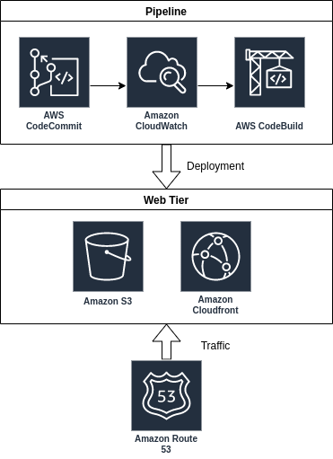

# Cumberland Cloud Web

This is a Single Page Application written in [Angular](https://angular.io) and [Angular Material](https://material.angular.io/) for my personal website and portfolio. The application is hosted on an [AWS Cloudfront Distribution](https://docs.aws.amazon.com/AmazonCloudFront/latest/DeveloperGuide/Introduction.html).

This repository includes everything you will need to build, deploy and host its contents. 

## Quickstart

### Development Server

```shell
cd app
npm install
ng serve
```

### Prerendered Development Server

```shell
cd app
npm install
npm run dev:srr
```

### Production Build

```shell
cd app
ng build
```

### Prerendered Production Build

```shell
cd app
npm run prerender
```

## Architecture

All of the resources to host, deploy and update this web application are contained as **infrastructure-as-code** within the _cloudformation.yml_ in the repository root. This template can be posted to **CloudFormation** with the appropriate parameters to provision a **CloudFront** distribution, several **S3** buckets, a **CodeCommit** repository, a **CodeBuild** project, a **CodePipeline** pipeline and several other resources to glue the whole environment together. The following diagram illustrates the architecture captured in this template,



If you have the [AWS CLI]() installed and configured, you can use the script `./scripts/provision-stack` to provision all the resources necessary to host and continously update the web application stored in this repository,

```shell
./scripts/provision-stack
```

This script will read in several key pieces of information. Before executing this script, you must own a domain on **AWS** through [Route53](https://docs.aws.amazon.com/Route53/latest/DeveloperGuide/domain-register.html). You will need the [hosted zone ID](https://docs.aws.amazon.com/Route53/latest/DeveloperGuide/ListInfoOnHostedZone.html) associated with your domain. In addition, in order to setup HTTPS with the **CloudFront** distribution, you will need to purchase a SSL certificate from the [AWS Certificate Manager](https://docs.aws.amazon.com/acm/latest/userguide/acm-overview.html). The script will require the AWS Resource Number (**ARN**) of the certificate.

After the stack is deployed, the pipeline will initially fail because the **CodeCommit** repository is empty. Add a remote origin to this repository with the **CodeCommit** SSH url,

```shell
git remote add codecommit <ssh-url>
```

In order to push and pull from this new repository, you will need to [setup your SSH key on CodeCommit](https://docs.aws.amazon.com/codecommit/latest/userguide/setting-up-ssh-unixes.html). After this is setup, you will need to push the current commit up to the repository to initiate the first pipeline build.

## Deployments

This repository is a public mirror of the actual source code; It is kept in sync with a **AWS CodeCommit** repository that is hooked into the **AWS CodePipeline** mentioned in the previous section; The **CodeCommit** mirror of this repository is, for all intents and purposes, the _"master"_ repository. What that means is the current state of the live frontend application is built on pushes to the **CodeCommit** `master` branch _only_; pushes to this **Github** repository do not trigger any builds or deployments. **CodePipeline** pulls in the changes from the **CodeCommit** push and pushes them in turn to **AWS CodeBuild**. **CodeBuild** uses the _buildspec.yml_ in the root of the repository to upload the build artifacts to an **S3** bucket, which is served through a **CloudFront** distribution at [cumberland-cloud.com](https://cumberland-cloud.com).
